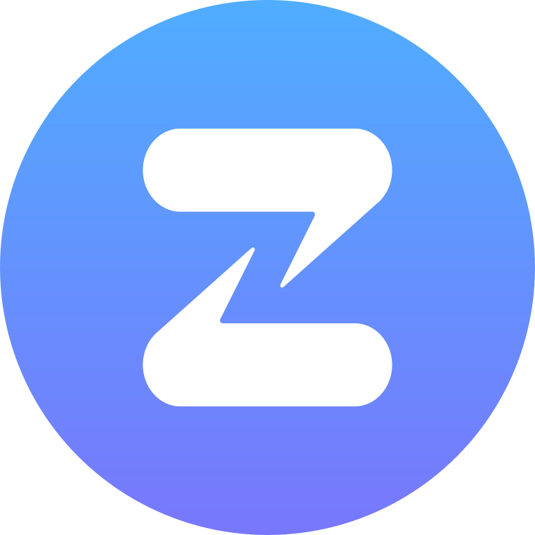

# Credits and Acknowledgements

AIgnite.Net is a very new project, started just at the end of August 2025. The vision is big, as you can imagine, so we need more people to make this happen.

It was started by [arvindd]([arvindd (Arvind Devarajan) · GitHub](https://github.com/arvindd/)) - but, you can imagine, starting is easy. It requires just a creation of a github repo, getting the other community-infrastructures enabled (Conversations, documentations, etc.). The real work comes after that - and it requires guts, perseverance, and passion to keep it warm and running.

We will have contributors added here as they join and begin contributions. To contribute, [check here](https://github.com/AIgnite-Net/aignite.net/blob/main/CONTRIBUTING.md).

## People

| Github id and link                     | Contribution Summary (optional)                                                             | Webpage (optional)      |
| -------------------------------------- | ------------------------------------------------------------------------------------------- | ----------------------- |
| [arvindd](https://github.com/arvindd/) | Started the project, and created the initial idea and vision. More contributions to follow. | https://blog.ramdoot.in |

## Organisations

| Logo                           | Organisation | Brief                                            | Acknowledgement                                        | Webpage            |
|:------------------------------:|:------------:| ------------------------------------------------ | ------------------------------------------------------ | ------------------ |
|  | Zulip        | Zulip is an organized chat for distributed teams | Sponsors the cloud-standard community for AIgnite.Net. | https://zulip.com/ |
